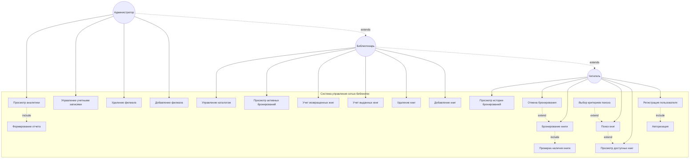

# Диаграмма вариантов использования: Система управления сетью библиотек



## Описание диаграммы

### Акторы

| Актор | Описание |
|-------|----------|
| Читатель | Базовый пользователь системы, может просматривать и бронировать книги |
| Библиотекарь | Наследует функциональность читателя, управляет книгами и выдачей |
| Администратор | Наследует функциональность библиотекаря, управляет филиалами и аналитикой |

### Варианты использования

#### Для Читателя
- **Регистрация пользователя** — создание учетной записи в системе
- **Просмотр доступных книг** — отображение каталога книг
- **Поиск книг** — поиск по автору, названию, жанру
- **Бронирование книги** — резервирование книги для получения
- **Отмена бронирования** — отмена ранее сделанного бронирования
- **Просмотр истории бронирований** — просмотр всех бронирований пользователя

#### Для Библиотекаря
- **Добавление книг** — внесение новых книг в каталог
- **Удаление книг** — удаление книг из каталога
- **Учет выданных книг** — регистрация выдачи книг читателям
- **Учет возвращенных книг** — регистрация возврата книг
- **Просмотр активных бронирований** — список текущих бронирований
- **Управление каталогом** — общее управление каталогом книг

#### Для Администратора
- **Добавление филиала** — создание нового филиала библиотеки
- **Удаление филиала** — удаление филиала из системы
- **Управление учетными записями** — управление пользователями и библиотекарями
- **Просмотр аналитики** — статистика по выданным книгам, популярности

### Связи

#### Include (обязательные)
- Регистрация пользователя **include** Авторизация
- Бронирование книги **include** Проверка наличия книги
- Просмотр аналитики **include** Формирование отчета

#### Extend (необязательные расширения)
- Поиск книг **extend** Просмотр доступных книг
- Выбор критериев поиска **extend** Поиск книг
- Отмена бронирования **extend** Бронирование книги

### Иерархия ролей

```
Читатель
    ↑
Библиотекарь (наследует возможности Читателя)
    ↑
Администратор (наследует возможности Библиотекаря)
```
