# Диаграмма состояний: Автомат по продаже билетов

```mermaid
stateDiagram-v2
    [*] --> Idle

    Idle --> WaitingForMoney : selectTicket() / показать цену
    
    WaitingForMoney --> WaitingForMoney : insertMoney(amount) [amount < price] / накопить сумму
    WaitingForMoney --> MoneyReceived : insertMoney(amount) [total >= price] / принять оплату
    WaitingForMoney --> TransactionCanceled : cancel() / вернуть деньги
    
    MoneyReceived --> TicketDispensed : dispenseTicket() / выдать билет
    MoneyReceived --> TransactionCanceled : cancel() / вернуть деньги
    
    TicketDispensed --> TicketDispensed : returnChange() [change > 0] / выдать сдачу
    TicketDispensed --> Idle : complete() / сброс
    
    TransactionCanceled --> Idle : reset() / сброс

    state Idle {
        [*] --> Waiting
        Waiting : Ожидание действия пользователя
        Waiting : Отображение доступных билетов
    }

    state WaitingForMoney {
        [*] --> AcceptingCoins
        AcceptingCoins : Прием монет/купюр
        AcceptingCoins : Отображение внесенной суммы
        AcceptingCoins : Отображение оставшейся суммы
    }

    state MoneyReceived {
        [*] --> Processing
        Processing : Проверка суммы
        Processing : Подготовка билета
    }

    state TicketDispensed {
        [*] --> Dispensing
        Dispensing : Выдача билета
        Dispensing --> ReturningChange : hasChange
        ReturningChange : Выдача сдачи
    }

    state TransactionCanceled {
        [*] --> Canceling
        Canceling : Возврат внесенных средств
        Canceling : Отмена операции
    }
```

## Описание состояний

| Состояние | Описание |
|-----------|----------|
| Idle | Начальное состояние. Автомат ожидает выбора билета пользователем |
| WaitingForMoney | Пользователь выбрал билет, автомат ожидает внесения денежных средств |
| MoneyReceived | Внесена достаточная сумма, автомат готов выдать билет |
| TicketDispensed | Билет выдан пользователю, возможна выдача сдачи |
| TransactionCanceled | Транзакция отменена, средства возвращены |

## Переходы между состояниями

| Из состояния | В состояние | Событие | Условие | Действие |
|--------------|-------------|---------|---------|----------|
| Idle | WaitingForMoney | selectTicket() | - | Показать цену выбранного билета |
| WaitingForMoney | WaitingForMoney | insertMoney() | total < price | Накопить сумму |
| WaitingForMoney | MoneyReceived | insertMoney() | total >= price | Принять оплату |
| WaitingForMoney | TransactionCanceled | cancel() | - | Вернуть внесенные деньги |
| MoneyReceived | TicketDispensed | dispenseTicket() | - | Выдать билет |
| MoneyReceived | TransactionCanceled | cancel() | - | Вернуть деньги |
| TicketDispensed | TicketDispensed | returnChange() | change > 0 | Выдать сдачу |
| TicketDispensed | Idle | complete() | - | Сброс автомата |
| TransactionCanceled | Idle | reset() | - | Сброс автомата |
